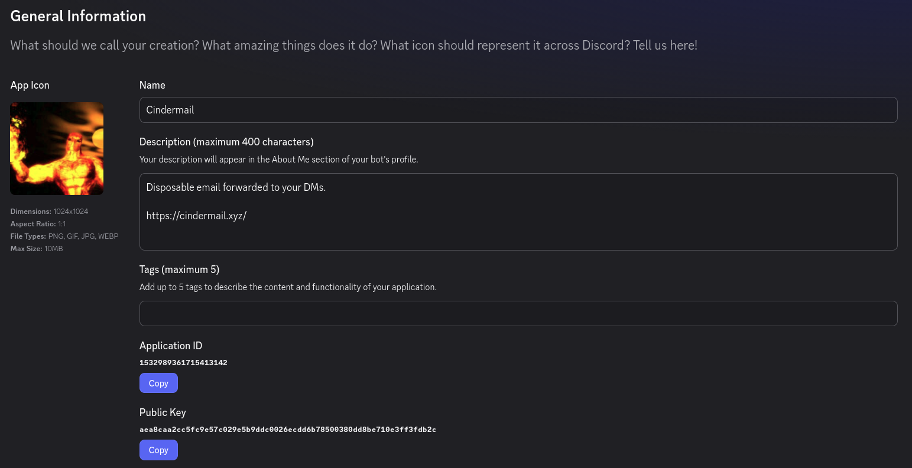
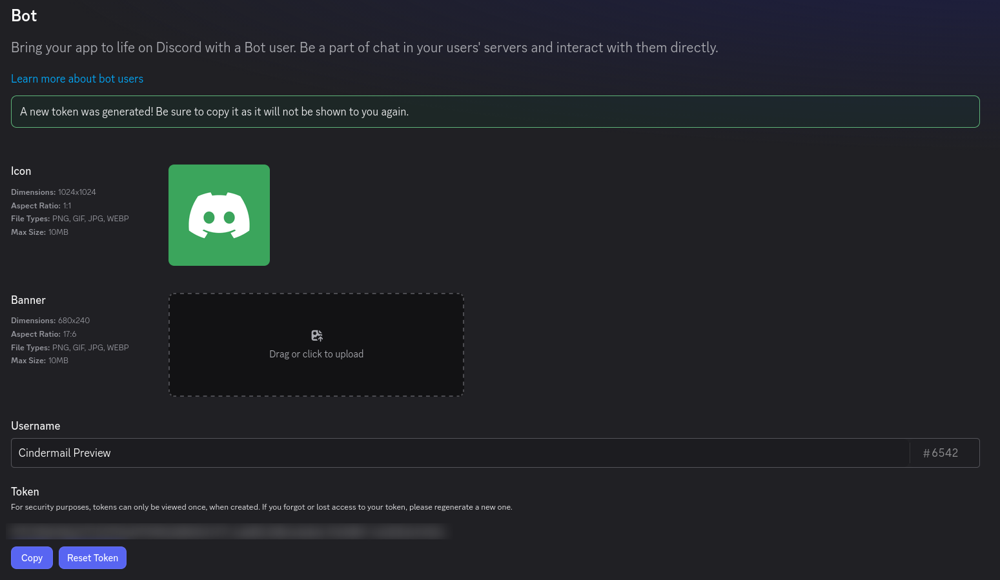
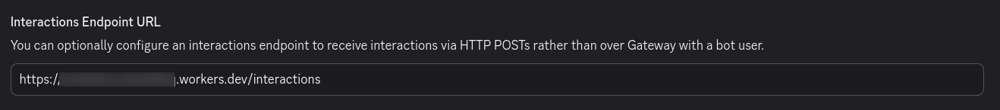
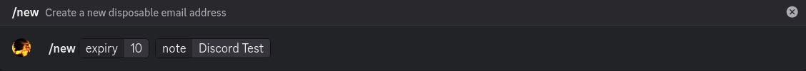
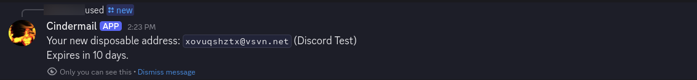
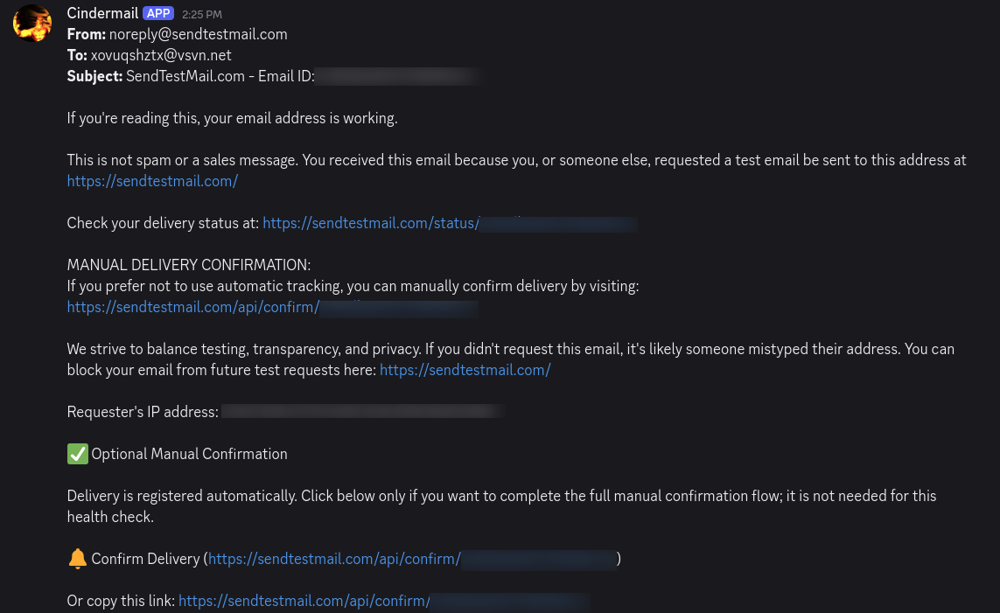

# Setting up the Discord adapter

This is what actually gets mail delivered. [deploy-cloudflare.md](deploy-cloudflare.md) only gets it as far as received and stored, so finish that first. Identical in either mode.

## What you need

- A cloned repo with `npm install` run in it. Steps 2 and 3 are commands, and `wrangler` comes from those dependencies rather than a global install.
- A deployed Worker, so you have a URL for step 4.

If you deployed with the button, clone your fork now if you haven't. Registering slash commands is a script with no dashboard equivalent, so there's no way around having the repo locally.

Every command below assumes your terminal's current directory is that cloned repo folder. `wrangler` reads `wrangler.jsonc` from wherever you run it, so a command run from anywhere else (your home folder, a different project) fails with `Required Worker name missing` rather than doing what it says — that specific error means "wrong folder," not a real problem with your setup.

## 1. Create a Discord application

At [discord.com/developers/applications](https://discord.com/developers/applications), create an application and give it a bot user under the Bot tab.

Two values on **General Information** — Application ID isn't secret, it's a public identifier; Public Key (Discord's own name for it) isn't either, it's only ever used to *verify* a signature, never to create one:



One value on the **Bot** tab, and this one actually is secret — Discord shows it exactly once, at creation or reset:



So, three values total:

- Bot token (Bot tab)
- Public key (General Information)
- Application ID (General Information)

## 2. Give it those credentials

```bash
npx wrangler secret put DISCORD_TOKEN
npx wrangler secret put DISCORD_PUBLIC_KEY
npx wrangler secret put DISCORD_APPLICATION_ID
```

Each prompts for the value. Stored encrypted by Cloudflare, never written to a file here. `npm run setup` offers to run them for you.

No terminal handy? Same result from **Workers & Pages → your Worker → Settings → Variables and Secrets → Add** for each one, **Type** set to **Secret**. Don't use the **Type: Text** option there, that's a plaintext variable that gets silently wiped the next time this Worker is deployed, since only `ADAPTERS` is declared in `wrangler.jsonc` and a redeploy makes that file the source of truth for anything not a Secret.

Skip this if the deploy button already collected them.

## 3. Register the slash commands

This one reads them from your shell rather than from Cloudflare, since secrets there can't be read back:

```bash
DISCORD_TOKEN=... DISCORD_APPLICATION_ID=... npm run register-commands
```

Only needs re-running when a command's name or arguments change, not every deploy.

## 4. Point Discord at your endpoint

On General Information, set the Interactions Endpoint URL to your Worker's URL plus `/interactions`:

```
https://<your-worker>.<your-subdomain>.workers.dev/interactions
```



Discord verifies it with a signed ping on save. A failure is almost always a `DISCORD_PUBLIC_KEY` that doesn't match the app's Verify Key, or a Worker that isn't deployed yet.

## 5. Try it

Works installed to a server or to just your own account, both enabled by default. Install link is on the Installation tab.

Run `/new`, Discord's own UI shows the structured options as you fill them in:



The reply is ephemeral, visible only to you, wherever you ran it from:



Send that address a test email and it arrives as a DM within seconds, regardless of where `/new` was run:



Mail always arrives as a DM even if you ran `/new` in a channel. Commands work anywhere the bot is; delivery only ever goes to the owner's DMs.

## Commands

Replies are ephemeral: only the person who ran the command sees them.

| Command | What it does | Rate limit |
|---|---|---|
| `/new [expiry] [note]` | Creates an address. Permanent unless `expiry` is set. | 1 per 30s |
| `/list` | Your addresses, notes, and expiry. | 15 per 60s |
| `/extend <address> [expiry]` | Changes when an address expires. | 15 per 60s |
| `/note <address> [note]` | Labels an address. Blank clears it. | 15 per 60s |
| `/torch <address>` | Revokes an address. | 15 per 60s |
| `/remind [enabled]` | Expiry reminder DMs. Blank shows the setting. | 15 per 60s |

## Expiry

`expiry` is in **days** on both `/new` and `/extend`. `0` means permanent.

```
/new                                  permanent
/new expiry: 7                        expires in 7 days
/new expiry: 0                        permanent

/extend address: x@you.com            10 days from now
/extend address: x@you.com expiry: 5  5 days from now
/extend address: x@you.com expiry: 0  permanent
```

One asymmetry: bare `/new` is permanent, bare `/extend` uses the 10 day default. `/extend` should do what its name says.

`/extend` sets expiry relative to now rather than adding to what's left. An address with 8 days left extended by `expiry: 5` has 5 days, not 13.

Permanent addresses count against your limit, and `/list` shows them as `permanent` rather than a countdown. Cleanup skips them, so `/torch` is what ends one.

## Notes

A random local part tells you nothing about what you used it for. `note` is an optional label, up to 80 characters, shown in `/list`:

```
/new note: netflix trial
/note address: x7k2p9qzrm@you.com note: bank alerts
/note address: x7k2p9qzrm@you.com            clears it
```

Only ever shown back to the address's owner.

## Expiry reminders

Off until asked for:

```
/remind enabled: true     DM about a day before an address expires
/remind enabled: false    stop
/remind                   current setting
```

One DM covering everything of yours expiring soon, with notes, so you can `/extend` what you still need.

It rides the daily cleanup cron, so it lands 24 to 48 hours ahead rather than exactly a day. An address living under about two days never gets one, since no run sees it with a day still left: `/new expiry: 1` won't warn.

`/extend` re-arms the reminder against the new expiry.

Defaults are configurable, see [configuration.md](configuration.md).
