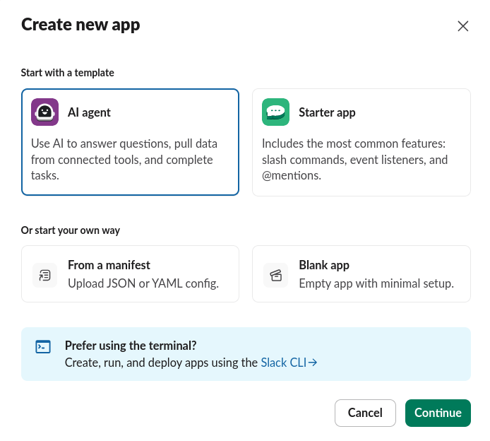
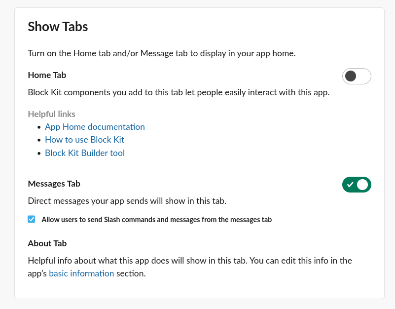
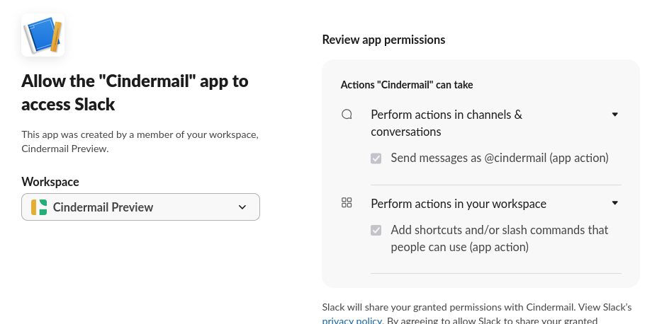
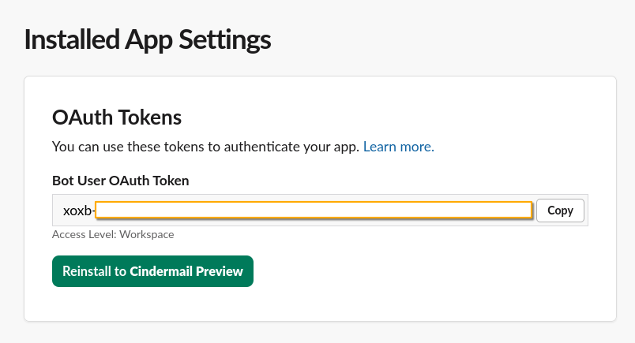
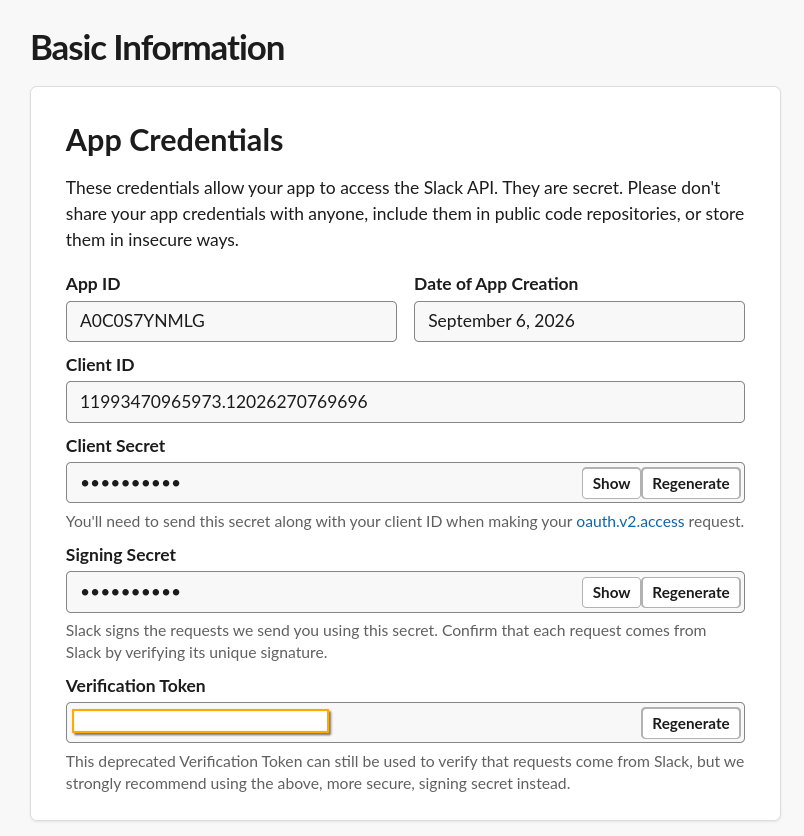
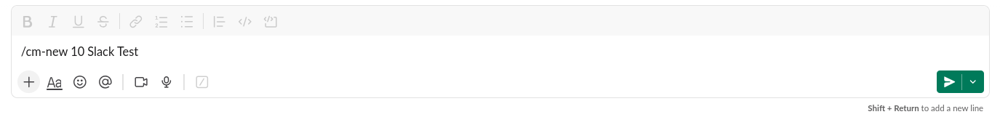
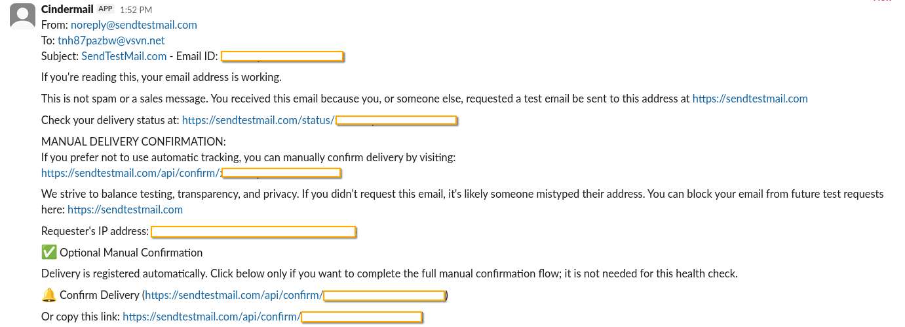

# Setting up the Slack adapter

Same six commands as Discord and Telegram, delivered as a Slack DM. [deploy-cloudflare.md](deploy-cloudflare.md) only gets mail as far as received and stored, so finish that first.

## What you need

- A cloned repo with `npm install` run in it.
- A deployed Worker (the same one from `deploy-cloudflare.md`, or a fresh one if you're not also running Discord or Telegram).
- A Slack workspace you can create an app in.

## 1. Create the app from a manifest

Go to [api.slack.com/apps](https://api.slack.com/apps) → **Create New App** → **From an app manifest** → pick your workspace.



Paste this in (YAML tab), replacing `YOUR-WORKER-URL` (six occurrences) with your actual Worker URL first — one find-and-replace, not six manual edits:

```yaml
display_information:
  name: Cindermail
  description: Disposable email delivered as a Slack DM
  background_color: "#f38020"

oauth_config:
  scopes:
    bot:
      - commands
      - chat:write

features:
  bot_user:
    display_name: Cindermail
    always_online: true
  slash_commands:
    - command: /cm-new
      url: https://YOUR-WORKER-URL/slack/commands
      description: Mint a new disposable address
      usage_hint: "[expiry] [note]"
      should_escape: false
    - command: /cm-list
      url: https://YOUR-WORKER-URL/slack/commands
      description: List your addresses
      should_escape: false
    - command: /cm-extend
      url: https://YOUR-WORKER-URL/slack/commands
      description: Change when an address expires
      usage_hint: "<address> [expiry]"
      should_escape: false
    - command: /cm-note
      url: https://YOUR-WORKER-URL/slack/commands
      description: Label an address
      usage_hint: "<address> [note]"
      should_escape: false
    - command: /cm-torch
      url: https://YOUR-WORKER-URL/slack/commands
      description: Kill an address
      usage_hint: "<address>"
      should_escape: false
    - command: /cm-remind
      url: https://YOUR-WORKER-URL/slack/commands
      description: Toggle expiry reminder DMs
      usage_hint: "[on|off]"
      should_escape: false

settings:
  org_deploy_enabled: false
  socket_mode_enabled: false
  token_rotation_enabled: false
```

Every command is prefixed `cm-` rather than the bare name: Slack rejects overly generic single-word command names outright, and `/remind` specifically collides with a real Slack built-in. The prefix is stripped back off before dispatch, so the six commands themselves work identically to Discord and Telegram.

## 2. Enable DM slash commands

Left sidebar → **App Home** → **Messages Tab** → turn it on, then check **"Allow users to send Slash commands and messages from the messages tab."**



Easy to miss, and the only step that isn't obviously part of "installing the app": without it, the app's own DM won't accept any input at all, commands included, even though the six slash commands work fine from a regular channel either way.

## 3. Install to your workspace

Left sidebar → **Install App** → **Install to Workspace**. The consent screen shows exactly the two scopes from the manifest, nothing more:



Click **Allow**.

## 4. Copy the Bot Token

Still on **Install App** (or **OAuth & Permissions**) → **OAuth Tokens** → copy the **Bot User OAuth Token** (`xoxb-...`).



## 5. Copy the Signing Secret

Left sidebar → **Basic Information** → **App Credentials** → **Signing Secret** → **Show**.



App ID and Client ID aren't secret, they're public identifiers. Client Secret and Signing Secret are, and Slack masks both by default. The Verification Token below them is deprecated but still live and shown in plain text — worth blocking out of any screenshot you take of this page, same as the two secrets above it.

## 6. Set both as secrets on the Worker

```bash
npx wrangler secret put SLACK_BOT_TOKEN
npx wrangler secret put SLACK_SIGNING_SECRET
```

Add `"slack"` to `ADAPTERS` in `wrangler.jsonc`'s `vars` (comma-separated with whatever else is there: `"discord,telegram,slack"`), then redeploy:

```bash
npx wrangler deploy
```

Your Request URL is `/slack/commands` on that same Worker — the same one for all six commands, since Slack sends the command name in the payload rather than needing a separate endpoint per command.

## 7. Try it

Open the app's own DM and run a command:



A reply comes back visible only to you, regardless of whether you ran it in the DM or a channel:


Send that address a test email and it arrives the same way Discord and Telegram deliver it — From/To/Subject header, then the body:



## Commands

```
/cm-new [expiry] [note]
/cm-list
/cm-note <address> [note]
/cm-extend <address> [expiry]
/cm-torch <address>
/cm-remind [on|off]
```

Plain text after the command, same shape as Telegram's: for `/cm-new` and `/cm-note`, a leading number is read as `expiry`; everything else is the note. For `/cm-extend`, the address comes first and an optional trailing number is the new expiry. See [docs/discord-adapter.md](discord-adapter.md) for what each command actually does, rate limits, and expiry/note semantics — identical across all three platforms, just the command prefix differs.

Unlike Telegram, there's no restriction to a private chat: Slack's `ephemeral` response type keeps every reply visible only to whoever ran it, even in a busy channel, so there's nothing to refuse.
